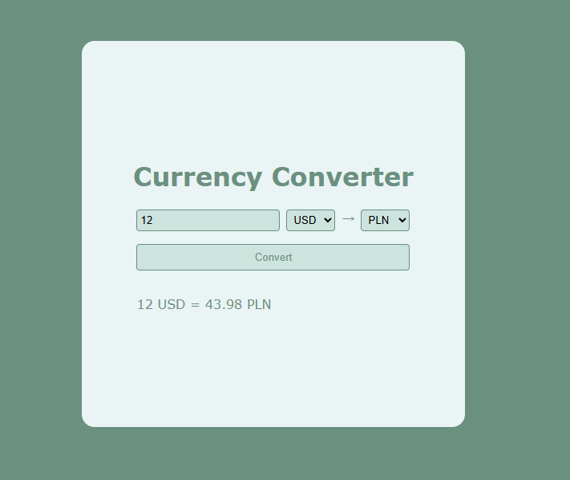

## 📝 Currency Converter
Виджет для конвертации валют, при разработке использовался следующий API: <a href="https://frankfurter.dev/">Frankfurter</a>

⚙️Технологии:
HTML5,
CSS3,
React,
Vite

## 🚀 Использование:
Требования: Для установки и запуска проекта, необходим NodeJS v8+.

Установка зависимостей
Для установки зависимостей, выполните команду: \
`$ npm i`

Запуск Development сервера
Чтобы запустить сервер для разработки, выполните команду: \
`$ npm run dev`

Создание билда \
Чтобы выполнить production сборку, выполните команду:

`$ npm run build`
